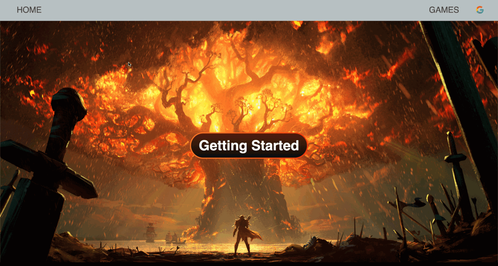

<h1 align="center">PC Game List</h1>

<h2 align="center">

  <a href="https://pc-game-list-478c919c2ed1.herokuapp.com/"> Access the Application 🎢</a>
</h2>

## 🏖️ Description

This Application is to view popular pc games in 2023 and add games to your collection list. You can also track you own this game or not.

## 🎃 Preview

## 🏆 Technologies Used

## 🕹️ How To Use
- Click **Getting Started** to enter the application.
- Log in your **Google account** to unlock all features.
- View games on the page and click **"+"** to add in your list.
- You can delete game in your list or in the game details page.
- Tracking if you own the game or not by the checkbox in the game details page.

## 🧸 Upcoming Features
- [ ] Add review comment under the game description.
- [ ] Add friend list and community system.
- [ ] Add search function so user can find the specific game.
- [ ] Can change display which year's popular game.
